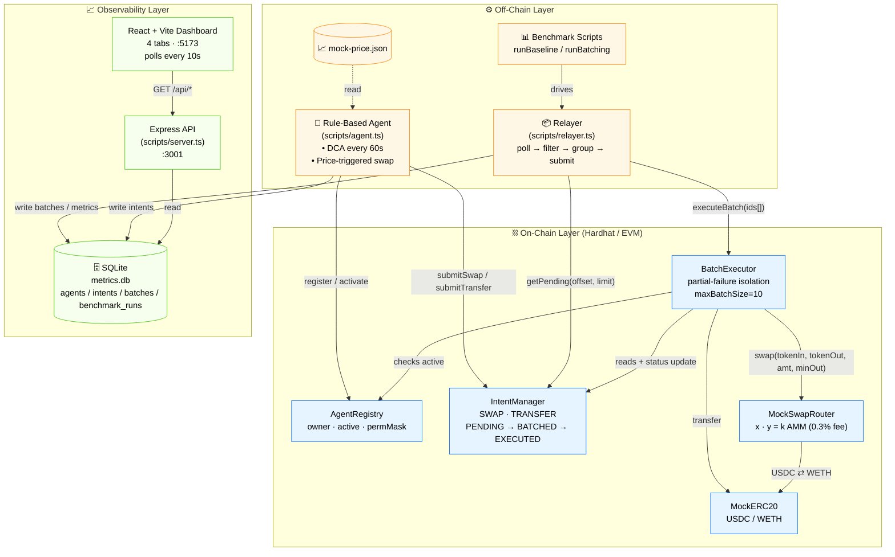
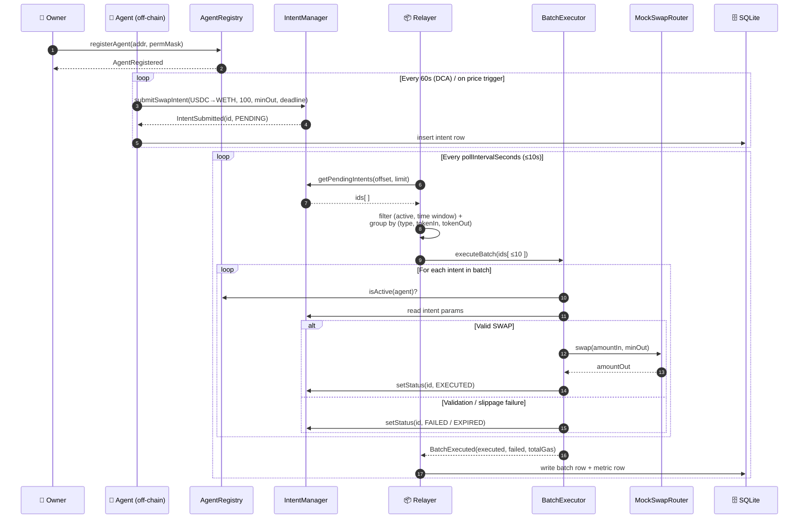

# Architecture — Macro-Intent Agent Execution Network

**Project:** SC6019 Option 1 — AI-Powered On-Chain Agent Protocol with Intent Infrastructure
**Version:** v0.1-MVP

---

## 1. Problem Statement

AI agents are emerging as a new class of blockchain users. Unlike normal users, agents may generate large numbers of actions, rebalance positions frequently, and interact with multiple protocols automatically. Traditional blockchain execution is poorly suited for this pattern: every intent competes for blockspace, suffers from latency, and incurs high gas cost.

This project explores how to build a more scalable infrastructure for on-chain agents by introducing **intent batching, asynchronous task handling, and parallelizable execution flows**, while preserving correctness and security.

---

## 2. High-Level Architecture

### 2.1 Component Overview



### 2.2 Intent Execution Sequence



### 2.3 Layer Responsibilities

The system has three layers:

1. **On-chain layer** — five Solidity contracts that store agent / intent state and atomically execute batches.
2. **Off-chain coordination layer** — TypeScript scripts that simulate the agent decision logic and the relayer batching loop.
3. **Observability layer** — SQLite, Express API, and a React dashboard that surface throughput / gas / latency metrics.

---

## 3. Smart Contracts

| Contract | Responsibility |
|---|---|
| `AgentRegistry` | Register agents, manage `active` flag, enforce per-agent permission mask |
| `IntentManager` | Accept SWAP / TRANSFER intents, manage status lifecycle, paginated queries |
| `BatchExecutor` | Execute up to `maxBatchSize` intents in one tx with **partial-failure isolation** + ReentrancyGuard |
| `MockERC20` | Test USDC and WETH (mintable for benchmarks) |
| `MockSwapRouter` | Constant-product AMM (`x * y = k`, 0.3% fee) — gives `minAmountOut` checks real meaning |

### 3.1 Intent Lifecycle

```
PENDING ──→ BATCHED ──→ EXECUTED
   │
   ├──→ FAILED       (validation / execution failure)
   ├──→ EXPIRED      (deadline passed)
   └──→ CANCELLED    (by owner or agent)
```

Only `BatchExecutor` can transition `PENDING → BATCHED → EXECUTED/FAILED/EXPIRED`. Cancellation is the only path the agent / owner can drive directly.

### 3.2 Partial Failure (Core Property)

`BatchExecutor.executeBatch` wraps each individual intent's execution in a try/catch-equivalent pattern. A single bad intent (slippage, expired deadline, inactive agent, insufficient allowance) is recorded as `FAILED`/`EXPIRED` but **does not revert the entire batch**, so the remaining valid intents still settle. This is what allows batching to scale: one misconfigured agent cannot poison the queue.

---

## 4. Off-Chain Components

### 4.1 Agent Engine (simulated AI layer)

The course description explicitly allows the AI layer to be simulated. Our agent uses two hard-coded rules:

1. **DCA** — every 60 s, submit `100 USDC → WETH` SWAP intent.
2. **Price-triggered** — when mock ETH price drops below 2800 USDC, submit `200 USDC → WETH`.

The price feed is a local JSON file. Replacing this rule engine with a real LLM only requires editing one decision function in `scripts/agent.ts`.

### 4.2 Relayer

A single TypeScript loop:

```
1. poll IntentManager for PENDING intent IDs
2. filter (agent active, in [executeAfter, deadline], gas price OK)
3. group by (intentType, tokenIn, tokenOut)
4. slice into batches of size ≤ maxBatchSize
5. submit BatchExecutor.executeBatch(ids)
6. record gas / latency / success / failure into SQLite
7. sleep pollIntervalSeconds
```

Configurable: `pollIntervalSeconds` (default 10), `maxBatchSize` (default 10).

### 4.3 SQLite Schema

Four tables: `agents`, `intents`, `batches`, `benchmark_runs`. The `benchmark_runs` table is the source of truth for the metrics dashboard's before/after comparison.

### 4.4 Express API + React Dashboard

`scripts/server.ts` exposes read-only endpoints (`/api/agents`, `/api/intents`, `/api/batches`, `/api/benchmarks`, `/api/metrics/comparison`). The React frontend has 4 tabs corresponding to those endpoints, with the Metrics tab showing the side-by-side baseline vs. batching comparison plus a gas-per-intent bar chart.

---

## 5. Relationship to ERC-4337 / Account Abstraction

This MVP implements a **simplified, intent-centric variant** of the ERC-4337 conceptual model:

| ERC-4337 concept | This project's analogue |
|---|---|
| `UserOperation` | `Intent` struct in `IntentManager` |
| `EntryPoint` | `IntentManager` + `BatchExecutor` (split into submission + execution) |
| `Bundler` | Off-chain `relayer.ts` |
| Smart wallet (account) | Registered `Agent` (EOA + permission mask) |
| Paymaster | **Not implemented** — gas paid by relayer/agent directly |
| `validateUserOp` (signature, nonce) | `BatchExecutor` validates `status==PENDING`, `agent.active`, time window, `maxGasPrice` |

Key differences:
- We deliberately use **higher-level intents** (SWAP / TRANSFER) rather than arbitrary `callData`. This trades expressive power for predictability and easier batching.
- The relayer is a **single trusted party** in this MVP. A production system would borrow ERC-4337's permissionless bundler model + reputation system.
- We omit Paymaster, which means agents must hold native ETH for gas. ERC-4337 would let users pay gas in ERC-20.

---

## 6. Trust & Security Posture

| Property | Mechanism |
|---|---|
| Authorization | Only registered + active agents can submit intents (permission mask checked on every submit) |
| Intent immutability | `BatchExecutor` reads parameters directly from `IntentManager` storage; relayer cannot tamper with `amountIn`, `recipient`, or `minAmountOut` |
| Slippage protection | SWAP enforces `minAmountOut` against the AMM formula |
| Deadline protection | Expired intents are marked EXPIRED in-batch |
| Cancellation | Owner / agent can cancel their own PENDING intent any time |
| Re-entrancy | `BatchExecutor` uses OpenZeppelin `ReentrancyGuard` |
| Overflow | Solidity 0.8.x checked arithmetic |

---

## 7. What is *not* in scope for the MVP

Documented for transparency; discussed only in the trade-off analysis:

- ERC-4337 Paymaster / signature aggregation
- Multi-relayer / decentralized bundler set
- Cross-chain intents (Across-style)
- REBALANCE / SCHEDULED_TASK intent types
- Real DEX integration (only mock AMM)
- LLM-driven agent (only rule engine)

---

## 8. Repository Layout

```
contracts/      AgentRegistry / IntentManager / BatchExecutor / MockERC20 / MockSwapRouter
scripts/        deploy / agent / relayer / seedIntents / runBaseline / runBatching / server / database
test/           contracts/ scripts/ database/ api/ integration/ security/   (132+ TDD cases)
frontend/src/   pages/{Agents,Intents,Batches,Metrics}.tsx
data/           metrics.db, deployed_addresses.json
report/         architecture.md, benchmark-results.md, tradeoff-analysis.md
```
